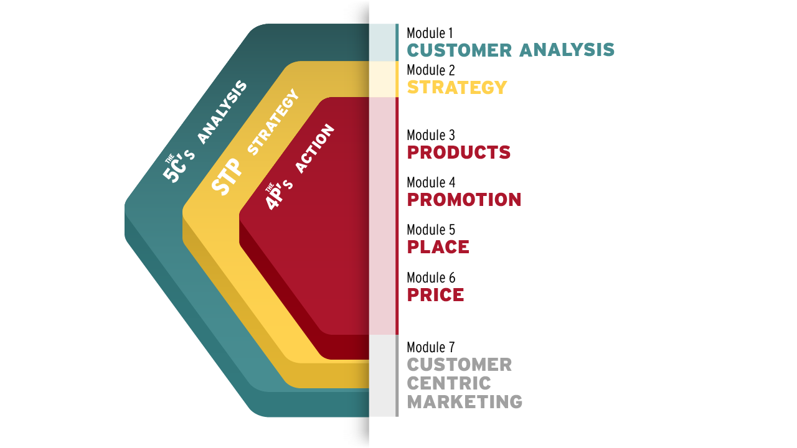

## Week1-Intro

- The course begins with consumer behavior as one aspect of analysis. It is the blue/green platform in the image above on which everything else sits.  Strategy, shown in yellow, rises out of that analysis and will be introduced in Module 2. Once you arrive at the heart of the course, the red section, we'll guide you through the action phase and decisions that can make or break your strategy. In the final module, we bring it home by discussing a customer-centered approach that threads through every part of the framework.

### **By the end of this course, you will be able to...**

- - Evaluate and select the best target segment where you will devote your time and resources.
  - Explore tactics to create the most value for your target customers to maximize profits.
  - Apply the framework to effectively analyze, strategize and act on key concepts to build strong relationships with your customers.

# Framework for Marketing Strategy

#### 5C’s

- Customer - What are the wants and needs of the customers? Whose needs can you satisfy profitably? How can the marketer create value for this customer and influence his or her decision making process? In a B2B context, who is part of the decision making unit?
- Company - What core competencies (i.e. resources, expertise) does your firm have that will allow you to meet the customer’s needs? What is it that your firm is very, very good at? What differentiates your firm, by creating value for the customer, from other firms in the market?
- Competition - Who else is meeting or attempting to meet your customer’s needs? When your customer doesn’t choose your product to solve their problem, whose do they choose? Think broadly to include current and emerging competitors.
- Collaborators - Are there other firms you will need to partner with to meet your customers’ needs? Do you need manufacturing help? Or a core piece of complementary technology in order for your product or service to succeed?
- Context - What environmental factors limit or expand your capabilities? Think PESTEL: the political, economic, social/cultural, technological, environmental, and legal context. What’s happening in the market in which you operate that can tilt the market (and your firm) toward success or failure?

#### STP

- Segment - Can you organize the customers into specific, similar groups? The most effective approach is to group them by wants and needs with regards to your product. However, firms also segment by demographics (because it’s easier) and by psychographic and behavioral differences.
- Target - Targeting is the process of deciding what segment you will address first with your marketing plan and how you will proceed through the remaining addressable segments. You should consider your firm’s strengths and weaknesses, your firm’ objectives, the resources needed, the collaborators available, and the potential financial returns of each segment.
- Position - How will you present your offering to your customer? Positioning involves developing a positioning statement that identifies the target customer, their wants, the product type/category, and the product’s key benefit. It also dictates how you will execute the marketing mix or the 4Ps.

#### 4P’s

- Product - Products, as well as services and experiences, are how you create value for your customer. You should consider to what degree you must provide a whole product or “complete turn-key solution” to your customer in order to create maximum value and induce them to buy.
- Price - How do you capture the value you’ve created? How much is your customer willing to pay for the value you’ve created?
- Place - What channel of distribution is best to provide access to your product for your consumers? This may involve a single exclusive distribution channel or an omnichannel composed of online sources, retailers, and your own outlets.
- Promotion - Promotion makes customers aware of your offering and builds the brand that will identify that offering and your company. Your main objective is to create brand awareness and build brand equity by defining your:
  1. brand identity
  2. brand meaning
  3. brand responses
  4. brand relationships.