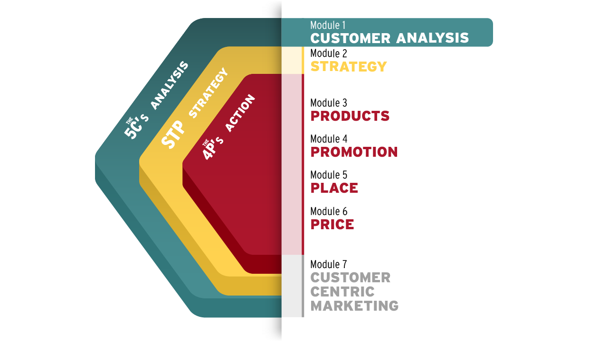

## Why Customer Analysis Matters

In the visual below, you will see that we begin with analyzing consumer buying patterns. This first module starts in Analysis, or the blue/green foundation from which strategy and actions emanate. 

Market analysis is important to the marketer because  **it allows you to devise a comprehensive strategy, so it makes sense to begin the course here.** 

In the marketing framework for Analysis, there are 5C's (Company, Collaborator, Customer, Competitor, and Context.) We are going to spend a little bit of time here exploring the concept of a customer analysis and, specifically, what influences consumer behavior.

- - Discuss factors that influence consumer behavior.
  - Identify and analyze the three consumer buying processes.

The first step of marketing is knowing your customer, so let's begin by analyzing our customer and unleashing the power of marketing.