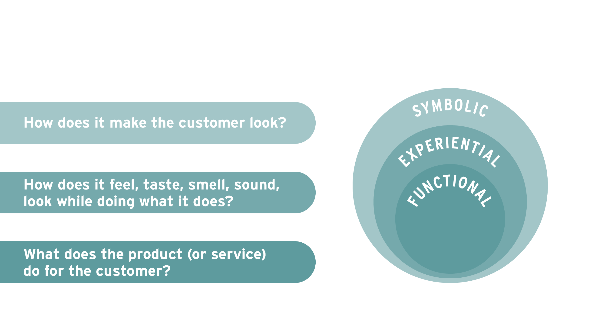

## 3.2 - Practice: Product Value

### Practice

This is the start to a comprehensive case which will focus on the razor market and combine the concepts we learned and practiced in Module 2 with a deeper understanding of how products create value for customers and how to position a product. At the end of the case, we will ask you to apply what you have learned to write a positioning statement for a razor company.

On this page, we will investigate, analyze, and compare two razor companies: Dollar Shave Club and Billie. After reading a little background on the global shaving market, you will learn about Dollar Shave Club and Billie and practice the concept of product value by discussing.

### READ

The global shaving market was $34 billion in 2016. You would think that the products in a market more than 100 years old would not be subject to much change and innovation these days. After all, a razor is just a sharp blade. How much product design changes can you really do with a sharp blade? However, the market has been going through significant disruptions over the last few years. Nearly 50% of adults don’t express strong brand loyalty and are inclined to try a variety of products. Online retailers are also impacting consumers; many believe that they can get better deals online. Both younger men and women (age 18-30) are likely to have frustrations with their shaving products. These groups are demanding better-quality shaves in less time. 

A number of new disruptors have come into this market, including Dollar Shave Club, Harry's Razors, and Billie. They have aggressively attacked "Big Razor" (the name they have given to the traditional players) and won substantial market share. 

These new disruptors have had a significant impact on Big Razor. Today, Schick has roughly 15% of the US razor market for men, which is 4% less than in it held in 2011, and Gillette has about 54% of the market. Together, the traditional brands have about 70% of the market, but only a few years ago Gillette alone controlled 70% of the market.

How did this market shift occur? How did new disruptors like Dollar Shave Club and Billie create value for their customers? As you read, watch, and discuss, keep in mind the augmented product concept:

One of the biggest disruptors in the field has been Dollar Shave Club, also known as DSC.  DSC became known for adopting a subscription model for its products.

Here’s the video--one of the most successful viral ads eve-- that made DSC famous.

### DollarShaveClub.com: Our Blades Are F***ing Great

VIDEO

### READ

Now that you have been introduced to Michael Dubin and the Dollar Shave Club, read the interview with Michael Dubin (Michael Dubin: Shaving America) and answer the three questions below. 

### **Read the article:** [Michael Dubin: Shaving America](https://www.cnbc.com/2017/06/21/michael-dubin-shaving-america.html)

Lucy Handley, "Michael Dubin: Shaving America," *CNBC*, August 23, 2017.

### Discuss

Complete the following in the discussion board below:

- Determine what type of value Dollar Shave Club creates for customers. Is it primarily functional, experiential, or symbolic? Share your answer in a post and support it with articles and other media that you find. 
- Find a classmate's post with a differing opinion and post why you find their argument convincing or why you disagree.
- Vote for the best arguments you see.

----------------

My Post:

DSC  positioned itself as a club, focused on the actual problems which men faced while purchasing a razor, and solved that problem effectively and efficiently, so it started  with creating functional value for its customers. However, DSC also offers experiential and symbolic values with it's grooming products.

A look at the dollar shaving club website (https://www.dollarshaveclub.com/), shows products can be personalized for experiential value and also top-shelf grooming product for symbolic values are on offer.

--------------

I would disagree, the major issue with Big Razor companies were that their customers only had the option to either empty their pockets to buy a good razor with better technology or to choose an inferior, painful shaving technology, so DSC started out to deliver functional value

--------------

### READ

As you have seen with DSC, Billie may not be the first to offer cheaper razors than those in drug stores, but it seems to be the boldest in marketing strategy. In addition to combatting the "pink tax," in a [new video](https://www.youtube.com/watch?v=P4DDpS685iI&feature=youtu.be), Billie now shows women shaving off actual hair on their bodies. While most companies advertise their razors with women shaving already smooth skin, Billie is highlighting the natural hair on women’s bodies with text that says across the screen in bold font: “Hair. Everyone has it. Even women.” It defies USA marketing taboos and traditions to show how their products work.

Billie co-founder Georgina Gooley said, “We went through a hundred years of women’s razors ads. You’re in the business of hair removal and you’re not even allowed to show hair because body hair on women is such a taboo!”

In contrast, while claiming to teach first-time shavers how to shave their legs while avoiding cuts and irritation, a Gillette Venus [video](https://www.youtube.com/watch?v=HpYUMIaHHlM) features a young woman that appears to have shaven before filming the video. It’s overly abundant that the women shown in typical razor ads never have the hair they bought the razor to get rid of in the first place. The Billie video feels strange simply because it shows what other ads haven’t in the past: women actually shaving.

Cheryl Wischhover, “It’s So Stupid That We Don’t See Female Body Hair in Shaving Ads,” Racked, June 26, 2018, https://www.racked.com/2018/6/26/17499646/women-body-hair-billie-shaving.

### Discuss

Complete the following in the discussion board below:

- Determine what type of value Billie's creates for customers. Is it primarily functional, experiential, or symbolic? What elements of Billie's products are designed for women? Share your answer in a post and support it with articles and other media that you find. 

- Find a classmate's post with a differing opinion and post why you find their argument convincing or why you disagree.

- Vote for the best arguments you see.

  ------------

  From mybillie.com:

  - Sharper* - 5 blades, sharper than your killer comebacks. 
  - *Smoother* - encased in 360° of charcoal shave soap to float over your skin.
  - *Affordable* - half the price of the competition.

Looking at mybillie.com The value statements mentioned are sharper,smoother and affordable. From these statements, I would classify Billie primarily creating functional and experiential value.

Billie's products are focused on women. Their products are advertised for female audiences with tagline "Billie is female first". The product features prominently mentioned relates to female demographics choices and needs such as color selection and ingredients. As a company, they donate 1% of all revenue to women's causes around the world. They have also classified male choice dominated razor products as pink tax.

--------------

### What type of value does DSC create for customer

DSC offers its customers experiential and symbolic value. Watch a few of their ads and you’ll see that DSC’s two main points of differentiation from traditional razors are that they are over-priced and difficult to buy. The humor employed and familiarity Michael Dubin seeks to create with his customers is all about symbolic value. With DSC you save money, and you are smarter for doing so. You are in on the joke; you, like DSC, are cool and funny. Similarly, DSC’s ads that humorously point out the absurd difficulty of buying razors in a story or pharmacy are also about experiential value. As one DSC ad declares: “buying razors sucks. Let us send 'em right to you.” The convenience of online shopping and home delivery are clear examples of experiential value.

### What type of value does Billie create for customers

Billie creates experiential and symbolic value for its customers. Billie’s campaign “Project Body Hair” is all about symbolic value. Billie claims to be the “first women’s razor brand to show hair,” making the point that women's body hair is a taboo subject, but Billie is bold enough to talk about it. Billie also claims to combat the pink tax, not just saving the customer money, but giving her a rebate for past pink razors she bought. While this is economic, it’s also aimed at creating symbolic value for its female customers. However Billie is not just trying to make women feel better about the razor they are using, Billie also creates experiential value by designing razors and body wash that are designed for women. On its website Billie writes: 'Fact: Women and men shave differently. Not all razors are created equal. Ours are designed for womankind.'