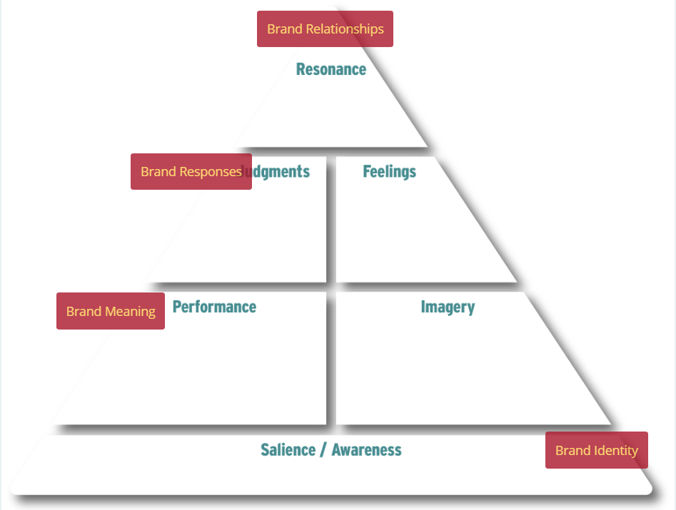
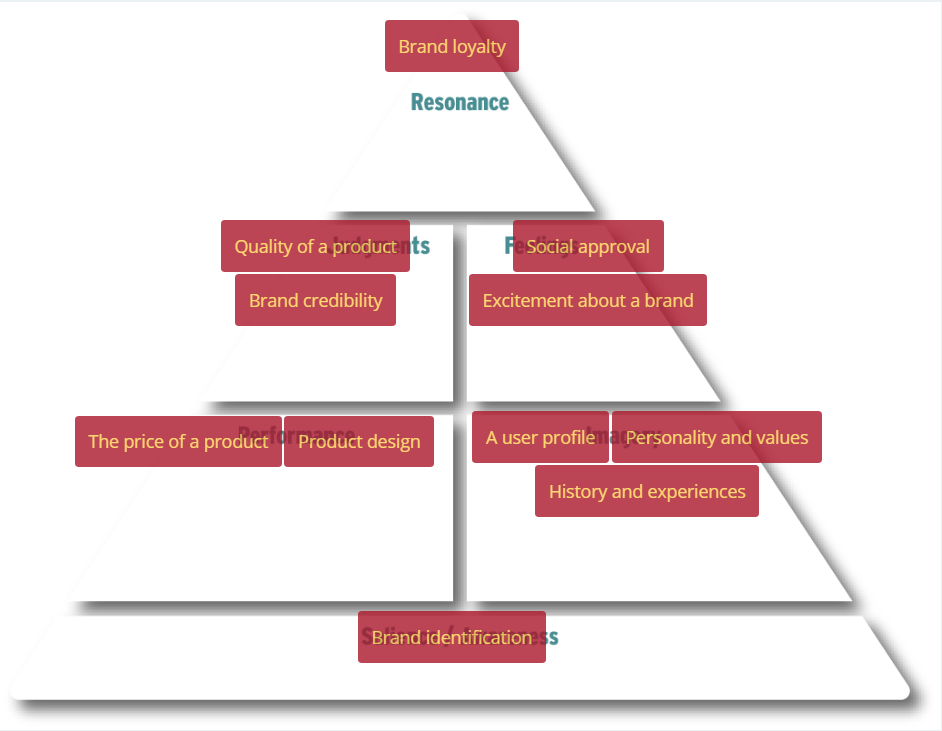

## 4.2 - Learn: Branding

### Read

As we saw in the previous section, promotional tactics deliver messages to consumers, but a **brand** is more than just a message, it's a company's promise to its customers. Brand building is a very nuanced process; it’s the result of interaction between the firm and its consumers and between consumers themselves. Brands can be built on logic and reason, but the strongest brands are also built on emotion, feeling, and perception. Brands provide benefits to both firms and consumers. The ultimate goal of any brand is to have customers who feel loyalty to the brand.

### Watch

In this seven-minute video, we'll discuss branding and the value it brings to customers and firms. Afterward, you'll answer some questions to check your understanding.

### Lecture - The Basics of Branding

VIDEO

### Recall

Explore the extent of your understanding of Kevin Keller's CBBE Pyramid. In this activity, you will find Keller's model and some aspects of brands. Select the red boxes of text by clicking on them and dragging them to the area of the pyramid addressed by that text. Read the feedback that pops up after dragging the image to figure out what you did wrong or right. That process looks a little something like this:

### Question 1 of 2

Match the six blocks of the pyramid with examples of *awareness,* *performance,* *imagery,* *judgments,* *feelings,* and *resonance*.

### Question 2 of 2

#### PROBLEM

Match the words with the six blocks of the pyramid they are associated with by dragging the words onto the area of the pyramid they represent. For example, "history and experiences" is an example of imagery.

