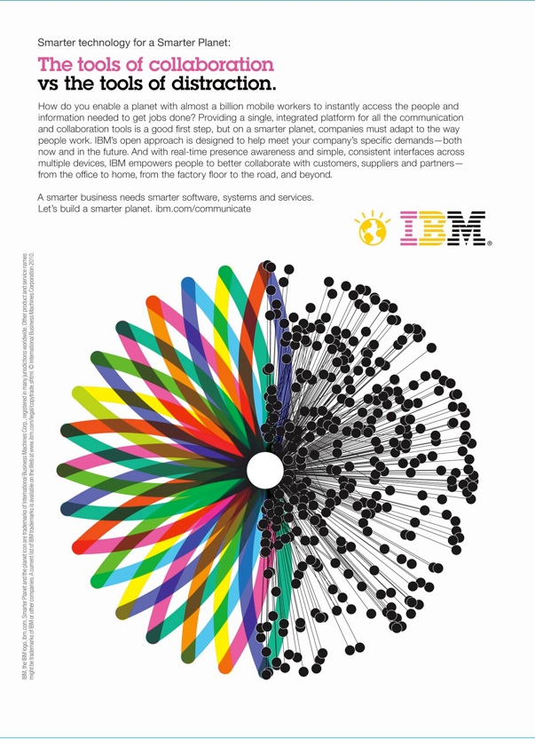

## 4.5 - Apply: IBM Case

IBM devised a campaign made up of public relations, social media, advertisements (both TV and print), and events to build its brand. Over the next two pages, we will look at examples of the different promotional tactics IBM used and try to understand how IBM built its brand.

We will start by looking at some of the public relation elements of the campaign.

### **Public Relations**

Sam Palmisano’s (former CEO and Chairman of IBM) speech at the Council on Foreign Relations kicked off the campaign by outlining how his firm’s capabilities could solve some of the greater problems the planet and its inhabitants were facing at that time.  This high profile, optimistic speech, given at the start of the Great Recession and garnered significant media coverage. 

### Watch

Watch a few minutes of Palmisano’s speech to see how Palmisano launched the campaign in the context of the financial crisis and Great Recession. The video is 54 minutes long; Palmisano starts his ten-minute speech at 2:40, which is followed by questions and answers with him.

https://youtu.be/i_j4-Fm_Svs

### **Print advertisements**

IBM ran what they called "Op-Ads"-- full-page advertisements that contained substantial text, explaining how IBM, through its use of predictive analytics, mobile connectivity and other technologies along with its consulting services could help address the challenges its target market was facing.  These ads targeted C-suite executives and government leaders and ran in publications those target markets read and trusted such as the Wall Street Journal. 

The ads you see below are shorter versions of the original ads, containing substantially less text but following up on the same theme: With IBM, complex, real-world problems could be addressed to achieve better outcomes for companies, government entities, and the planet. 

Examine this print ad and then place it on the branding pyramid activity below.

 ### Explore

In this activity, you'll explore how Kevin Keller's CBBE Pyramid relates to IBM's Smarter Planet campaign.

You will find Keller's model and an image representing the ad you just looked at. Select an image by clicking on it and drag it to the area of the brand pyramid that it best matches. Afterward, look at the feedback at the bottom of the question.

#### PROBLEM

What part of the brand pyramid does this ad address? (There may be more than one correct answer). Once you have found the correct answer, read the in-depth feedback under the pyramid.

Within its target segment, IBM had near-universal brand awareness. These ads really work at the second level of the pyramid by developing the set of associations the target market has with the brand. They work to refine and expand how the target market views the solutions that IBM can bring -- the left side of the pyramid associated with **performance**. In the aspirational text of solving big, complex problems faced by the planet, they also work at the third level on the right side, creating **feelings** of warmth, self-respect and social approval by solving these problems.

### **TV Advertisements**

The Smarter Planet campaign also used TV advertising to promote its message.  Take a look at two 30-second TV ads that were part of the campaign:

### **Watch:** [IBM Data Analysis](https://www.youtube.com/watch?v=VbhrV_OY-oc&list=PLqJeFUp_WQXqzSIyYd2U9vuiaPHyuelqG&index=6)

### **Watch:** [IBM Build a Smarter Planet](https://www.youtube.com/watch?v=ib1H-8bKhcM) 

Let's think about how these ads relate to the brand pyramid. The first one (Data Analysis)  is about using data to build a better transportation system.  While that’s very “performance” oriented (what the brand does), it also mentions the benefits of doing so: cutting commute times and reducing carbon emissions.  While these are still performance metrics, they are also, in the context of the Great Recession, sources of potential emotional benefits. 

The second commercial (build a Smarter Planet) is unambiguous about the what the brand does: It creates a better world and happier people. There is an explicit connection between building a smart planet and the outcomes for the people and IBMers who help make it smarter.   

### **“Out of home” Advertisements**

### **Watch:** [IBM & Ogilvy France Create Ads With A New Purpose in its latest “People For Smarter Cities”](https://vimeo.com/67570047)

This video highlights some of the “out of home” advertisements IBM created for the Smarter Planet campaign.  These ads encouraged people who might be “sitting on a smart idea for your city” to submit those ideas at the URL peopleforsmartercitites.com.  These ads are interactive in two ways. First, the ads are actually “smart” in that they provide functional use as benches, shelters, and ramps.  Second, they encourage the viewer to engage with the campaign by submitting their own ideas for a smarter city. 

#### Where do you see this ad working on the branding pyramid? 

#### PROBLEM

At what level do the “Out of home” Advertisements work? Once you have found the correct answer, read the in-depth feedback under the pyramid.

These ads function at both the top and the bottom of the pyramid. It brings the “Smarter Cities” campaign to the individuals in a city, and it is an example of IBM working at the top of the pyramid -- engagement and community.

