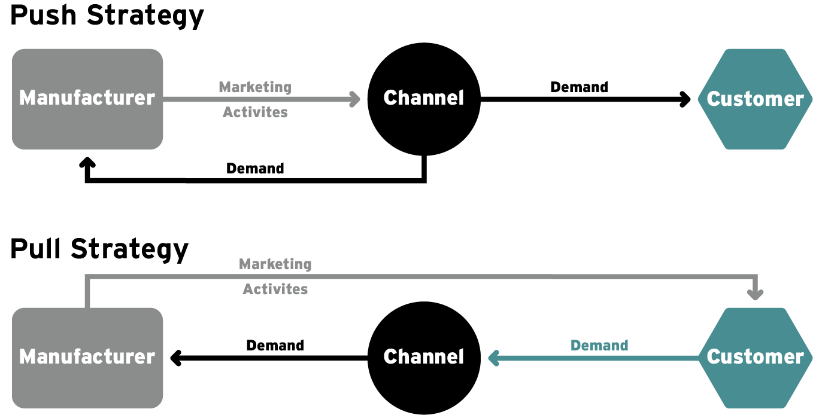

## 5.2 - Practice: Push and Pull Promotion

### Practice

Now that we have a good understanding of both **channel** **design** and management and **push** and **pull** **promotion**, let's dive deeper by finding real-world examples of both and analyzing and discussing them with our peers.

### Reflect

Think about a product that you recently purchased where you had multiple options of channels from which to buy.  Ideally, think of a product that you could easily purchase from a physical retail store nearby or from an online outlet such as Amazon or the manufacturer’s own website.  

Now, think about what functions each channel does a better job of providing.  From your perspective as a customer, which channel does a better job of generating demand?  Fulfilling demand?  Ensuring you’re happy?  From which channel do you think the product creator learns the most about what the marketplace actually wants?  

Provide evidence of your answers, be specific.  

Finally, assume for a moment that you are a representative of a particular target segment.  For the product you are thinking of, which channel do you think is most effective at serving your segment?  Is there a different target segment that you think the other channel might be serving more effectively?  What is it?  

### Post

Complete the following in the discussion board below:

1. Write 2-4 sentences answering the questions above. 
2. Comment on your peers' posts to suggest additional reasons for different channel designs. 
3. Vote for examples that you think are the best examples of two different channels designs serving two different segments.

my post:

I recently bought a printer the product can be brought through Amazon or going to electronic stores or at printer manufacturer's (HP) website.

Searching a comparing products is quick and easy at Amazon. Retail store lets customer feel and try before buy. Manufacturer's website is good place to go once product has been selected.  Amazon can be used for generating demand by placing discover ads on amazon, however, Retail channel is best at generating demand as the customers can be influenced by trained and incentivized salesperson or banner placements. Both online and retail channel do well for demand fulfilment and amazon does a great job at customer care but there are many ecommerce platforms that dont do as well at customer satisfaction, I have similar experience with retailers as well. The manufacturer's channel would be most concerned with making customer happy as this directly impacts their brand.

The online channel  provides most data and analytics for product creator, however, non-analytical aspects (perception/new product feature etc) is better provided by retail channel.

I am representative of the target segment representing buyers who prefer to buy online and are cost conscious. For my product, Printer, online channel is most effective. Products can be compared and ordered at my convenience. Older demographics may prefer retail channel as they may need help with information and setup of the product.

### Read

Once you get your products into the place you want to sell them, it does not mean they will sell themselves. Push and pull promotion becomes key for getting your product off the shelves and into your customers’ hands. As discussed in the video there are really only two options:  invest in generating demand from the end customers or invest in the channel. We all know what pull promotion looks like because we see it every day in ads and coupon offers. But what about push? Sometimes we might think that a salesperson is a bit too motivated to sell us a particular product; this might lead us to rightly assume that she or he is being influenced by a manufacturer’s push promotion, possibly in the form of a commission. However, push promotion is not always so easy to see. For instance, maybe the channel has been offered a greater profit margin on our products. By increasing the channel’s margins our product is moved to a prominent place in the store.

### Reflect

Now that you have learned about push and pull promotions, think about how these tactics have influenced you as a consumer.

- Think of a recent purchase you made that might have been influenced by push promotion (behavior of salespeople, placement of product, etc.) or one that was influenced by pull promotion (advertising, demos, consumer deals, etc.). 

- Think of the tactics you experienced.

  ### Post

  Write 2-3 sentences answering the questions below and post them to your individualized cohort of friends below.

  - What was your purchase?
  - Did you experience push or pull promotion?
  - How do you know?

  Return to read posts from your peers.

  - "Like" or up-vote five of the other examples that resonate with you.

  My post:

  I purchased a TV at a retail store. The promotion was a pull promotion. The manufacturer advertised the product on TV and print media and gave discount. There were many competing brands of TVs in the store and I didnot notice any special treatment/placement of the product I bought.