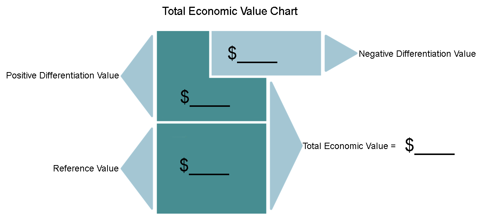

## 6.3 - Learn: Total Economic Value

Now that you have had an introduction to total economic value, read a brief scenario and apply what you have learned. We'll walk through this one together, and then on the next page, you will try one on your own

### Read

### **Super Cool Systems - An HVAC Case**

**Background**

You land a job at the heating, ventilation and air conditioning (HVAC) company, Super-Cool Systems. This firm sells HVAC for residential and small commercial buildings.  You have received a request to quote a price for a new HVAC system for a small office building. Super-Cool intends to provide a price on the most energy efficient HVAC system it works with, but admittedly, it isn't so efficient.

**Your Role**

You have a company meeting coming up where you will present insight to the management on what the price ceiling is for this job. To prepare, you will calculate the total economic value (TEV) for this customer. If you think back to the video, you will need three inputs to calculate the total economic value: the reference price, positive differentiation, and negative differentiation. You should remember this chart from the introductory video.

**The Specifics**

- The next best alternative is a system from the Good Air Company and is priced at $22,000. This is what the customer would purchase if they didn't purchase from Super-Cool. **(Reference price = $22,000**)

- Super-Cool requires 4 hours of maintenance a week, but Good Air (the next best alternative) requires 5 hours of maintenance a week. Super-Cool service costs $55/hr, but Good Air has a newer, more energy efficient system and maintenance service costs $65/hr. If calculated over 52 weeks a year this gives Super-Cool a positive differentiation value of $5,460. In addition, Super-Cool installation is $5200 less to install. **(Positive differentiation = $10,660)**

  - Super cool 4*55=220 /week =220\*52=11440/year

  - Good air 5*65=325 /week = 325\*52=16900/year

  - good air- supercool=16900-11440=5460

    

- Good Air uses 40 kw/hr to cool the building and Super-Cool uses about 62 kw/hr for the same outcome so is less energy efficient. Our customer tells us that this small office building runs 8 hours a day, 365 days per year.  At $0.12 per Kilowatt hour, this means the cost of the extra power use comes to $7,880 more to cool with Super-Cool. **(Negative differentiation = $7,880)**

  - Supercool 62\*8\*365=181040 kw/year=181040\*.12=$21724.8/year
  - Good air 40\*8\*365=116800 kw/year=116800\*0.12=$14016/year
  - Good air- Supercool=$ -7708.8/year

  ### Calculate

  **Here, we have taken the numbers provided above and put them in the chart for you.** 

  

When you add the reference value and the positive differentiation and subtract the negative differentiation. You will arrive at a **total economic value of $24,780.**

### Conclusion

**Is this the price you will quote to the potential customer?**

No. There are several reasons why. When you arrive at Total Economic Value (TEV) you are arriving at the price for a completely indifferent and rational customer. We don't want the customer to be indifferent. In addition, customers are rarely fully informed, or fully rational. 

**What does the exercise of calculating TEV provide you?** 

TEV provides us with insight into our price ceiling for this product. It is important to remember that total economic value can (and often will) differ between different market segments. 

-------------------------

On the next page, you will apply what you have learned on Total Economic Value to a new case and calculate total economic value yourself. This will be excellent preparation for the final exam.

### Optional audio Lecture

### **Total Economic Value - Further Exploration**

This optional podcast will provide a little more information on Total Economic Value and will dive a little deeper into the concepts covered in the Super-Cool example. Here, we'll talk a little about how TEV can differ in different market segments. Give it a listen when you get a chance!

AUDIO