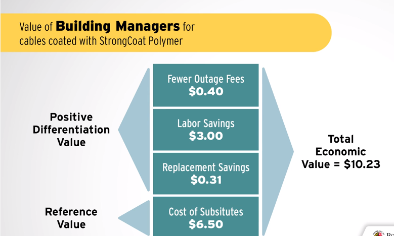
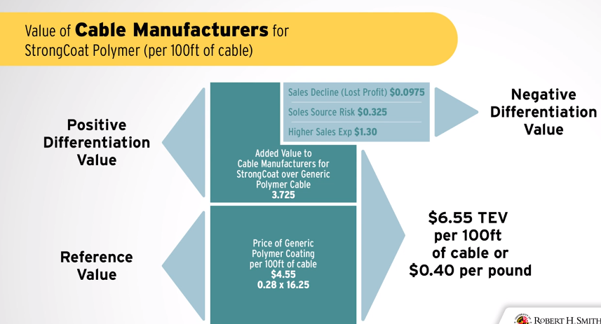

## 6.4 - Apply: Total Economic Value Case

Now that we understand **Total Economic Value**, lets read a brief scenario and apply what we have learned. This is good practice for the final exam. 

After you complete the problem watch the video solution and see how you did.

### Read

### **StrongCoat - The Cable Coating Case**

**Background**

After your MBA, you get a great job at PolyCo, a company known for innovation. PolyCo has often faced the problem of determining the economic value for new, differentiated products. When you arrive on the job, PolyCo is about to introduce **StrongCoat**, a covering for communication cables used in buildings. PolyCo sells its polymer coating to cable manufacturers. So StrongCoat will compete with other coatings currently manufactured with cables. 

StrongCoat has a differentiating advantage. Tests indicate their cable is substantially more durable:

| Cable Failure Rate |                   |
| ------------------ | ----------------- |
| StrongCoat cables  | Competitor cables |
| 3%                 | 8%                |

**Your Role**

Your boss walks into your office and asks you to help PolyCo set a price for StrongCoat. Below is a summary of your conversation with her. 

Determining the right price for StrongCoat is complicated because to figure out what the coating is worth, you need to understand if more durable and more reliable communications cables are worth more to the people who build and operate office buildings. Your boss assures you that it is.

Despite her scientific background and lack of MBA, she has a good nose for marketing. She conducted a few interviews with cable makers AND their customers. Here are some facts she discovered about buyers of the communication cables. She specifically talked to large-scale office building managers who use such cables to provide communications infrastructure to their tenants.   

- The next best alternative on the market to a cable covered with StrongCoat is a cable covered with a generic material. That cable sells for $6.50 per one hundred feet. 
- Generic coating sells for $0.28 per pound to cable manufacturers.
- It takes 16.25 pounds to coat 100 feet of cable.
- With StrongCoat covering, the cable is more durable which means that building managers have to buy less replacement cable, specifically 5% less (based on 8% to 3% reduction in failure). 
- The labor cost to a building manager of replacing a failed 100-foot section of cable is about $60.  
- When cable failure occurs during critical business hours, it can lead to revenue loss for the building manager via refunds owed to tenants for communication outages. This “outage refund” (as it is called) might range from $0, if the failure occurred after hours or on weekends, to $40 if during the most critical times of the day. These critical hours make up approximately 20% of the time the building is in use.  
-  Your boss has done customer interviews with cable manufacturers and knows that cable makers don't like to be beholden to a sole source. Therefore, PolyCo will compensate them for this at $0.33 per 100 feet of cable. 
- However, StrongCoat cable will be more expensive and manufacturers will need to convince builders to pay for higher quality cable at $1.30 per 100 feet of cable
- The last piece of information, that you already knew is as follows: to make StrongCoat (Cost of Goods Sold, or COGS) is $0.25 per pound.  PolyCo has market intelligence estimates that the “generic” coating sold by PolyCo’s competitors has a manufacturing cost (COGS) of approximately $0.22 per pound.

------------

Reference value:   

$6.50 per one hundred feet

Generic coating sells for $0.28 per pound to cable manufacturers

It takes 16.25 pounds to coat 100 feet of cable

Reference value: $0.28/pound --> 0.28*16.25= $4.55/100 feet of cable

Positive differentiation value:

With StrongCoat covering, the cable is more durable which means that building managers have to buy less replacement cable, specifically 5% less (based on 8% to 3% reduction in failure). 

5% of 6.50=$0.325/100 feet of cable --> 16.25 pounds

for coating pricing=0.325/16.25=$0.02/pound of coating

The labor cost to a building manager of replacing a failed 100-foot section of cable is about $60.  

5% of $60=$3/100 feet of cable

for coating pricing=3/16.25=$0.18/pound

When cable failure occurs during critical business hours, it can lead to revenue loss for the building manager via refunds owed to tenants for communication outages. This “outage refund” (as it is called) might range from $0, if the failure occurred after hours or on weekends, to $40 if during the most critical times of the day. These critical hours make up approximately 20% of the time the building is in use. 

20% of 40$ (unit??)=$8

5% of $8=$0.4 --> 100 feet

0.4/16.25=0.02/pound

Negative differentiation value:

Your boss has done customer interviews with cable manufacturers and knows that cable makers don't like to be beholden to a sole source. Therefore, PolyCo will compensate them for this at $0.33 per 100 feet of cable. 

preferred supplier (??) : $0.33/100 feet 

0.33/16.25=0.02/pound

However, StrongCoat cable will be more expensive and manufacturers will need to convince builders to pay for higher quality cable at $1.30 per 100 feet of cable

$1.30/100 feet of cable

1.3/16.25=$0.08

The last piece of information, that you already knew is as follows: to make StrongCoat (Cost of Goods Sold, or COGS) is $0.25 per pound.  PolyCo has market intelligence estimates that the “generic” coating sold by PolyCo’s competitors has a manufacturing cost (COGS) of approximately $0.22 per pound.

ceiling price: 0.25$/pound

-----------------------

### Calculate

What is the **total economic value** to building managers of one hundred feet of cable covered with StrongCoat? *(If you calculate this for your new boss, you are going to look like a marketing rock star.)*  

My Calc:

Total Economic value=0.28+0.02+0.18+0.02-0.02-0.08=$0.4/pound

From cable point of view:

cost for generic coating cable/100 feet: $6.50 per one hundred feet

replacement cable advantage: 5% of 6.50=$0.325/100 feet of cable

labor cost saving: 5% of $60=$3/100 feet of cable

power outage saving:20% of 40$ =$8 =5% of $8=$0.4

From coating point of view:

Reference cost=$0.28/pound --> 0.28*16.25= $4.55/100 feet (0.28/pound)

Positive differentation:

replacement advantage: 5% of 6.50=$0.325/100 feet of cable (A) (0.325/16.25=0.02)

labor: 5% of $60=$3/100 feet of cable   (B)  (3/16.25=0.18)

power outage saving:20% of 40$ =$8 =5% of $8=$0.4 (C) (0.4/16.25)

A+B+C=0.325+3+0.4=3.725

Negative differentiation:

if cable fail less the customer buys 5% less: 6.5 (current price of cable/100 feet) -4.55(cost of coating for 100 feet)= 1.955/100 feet --> 5% less is 0.0975 cent/100 feet  (D)

supplier preference:  $0.33/100 feet  (E)

expense for manufactures to use higher qlty coating: $1.30/100 feet of cable (F)

D+E+F= 0.0975+0.33+1.30=1.7275

R+A+B+C-D-E-F=4.55+0.325+3+0.4-0.0975-0.33-1.30=6.55

-----------------------------------------------------------------

Question: how can i know the TEV for a Tailor- made products, which cannot be found in the market, because they do not exist, just like factory that are contracters and they do products by contract, how can they know how much they can charge not using the cost plus pricing method?

Answer:prof_furst:  Just to make sure I'm on the same page, when you say "tailor made" products, you mean a product that is created uniquely to solve a customer's problem/address a need. You may even mean a "one-off" or single copy of an item, correct?

Let's imagine you have an artisan who is making custom wrought iron and wood tables. The COGS can be calculated by adding up all of the costs associated with producing the table. The artisan will have to assign some value to his/her hourly effort to build the table and add in the materials costs. This will give the artisan a floor for price. S/he will not want to sell the table for less than the costs associated with making it. However, this doesn't capture the *value* to the potential customer. In order to do that, we would again use the TEV principle.

- First, we would ask the customer or do some research with past customers to understand what the cost is for the next best substitute. So, in this case, the customer could have seen a mass-produced table that is sort of similar in a catalog. That is going to be our reference price.
- Next we are going to use our marketing tactics to create unique value for the customer. We include a story of the artisan, explain the origin of the wood, tell a story about the process for hand-making the table. All of these elements add value to the reference price. In fact, you can often see this value reflected in a customer's words and actions when describing the purchase. The new owner of the custom table will tell an admirer about the artisan, the wood, and the uniqueness of the table.

One last note on TEV...especially in this example...We have to select our target market very carefully. If our target market is influenced by a need to stand out from the crowd, have unique items, and be affluent enough to purchase them, then we can likely satisfy the market. However, if we have a price conscious consumer who is driven to have the least expensive solution, we might not get them to pay more than the reference price (buy the mass produced table in the catalog) because they simply don't see the value in our hand-crafted table.

Let me know if this helps to clarify. I'll be on a live session with Dr. Frels on Monday and am happy to take more questions then as well! Dr. Furst